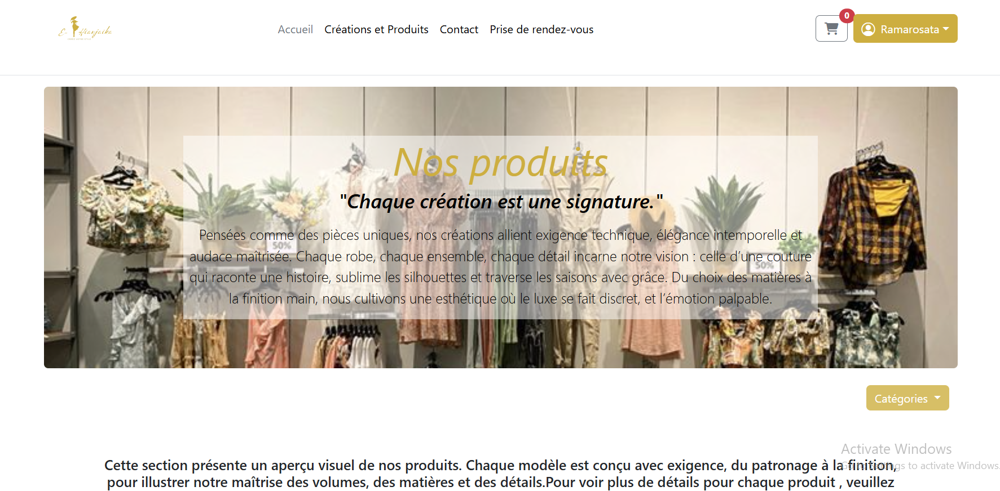

# ModeUnique - Maison de Couture
ModeUnique est une plateforme web complète pour une maison de couture, offrant une vitrine pour les créations, une boutique en ligne, la prise de rendez-vous et un panneau d'administration pour une gestion complète de l'activité.

##  Fonctionnalités
### Côté Client
- **Accueil & Pages de contenu** : Présentation de la marque, des services et des créations.
- **Galerie de Créations** : Une vitrine pour les pièces uniques.
- **Boutique en Ligne** :
    - Catalogue de produits avec recherche et filtrage par catégorie.
    - Fiches produits détaillées.
    - Panier d'achat dynamique.
    - Processus de commande sécurisé.
- **Prise de Rendez-vous** : Un module de réservation avec un calendrier interactif pour choisir une date et un créneau horaire.
- **Espace Utilisateur** :
    - Inscription et connexion.
    - Consultation de l'historique des commandes.
    - Mise à jour des informations personnelles.
- **Avis Clients** : Possibilité de laisser un avis sur le service.
- **Formulaire de Contact** : Pour toute demande d'information.

### Côté Administrateur
- **Tableau de Bord** : Vue d'ensemble des statistiques clés (ventes, commandes, etc.).
- **Gestion des Produits (CRUD)** : Ajouter, modifier, supprimer des produits.
- **Gestion des Catégories (CRUD)** : Organiser les produits par catégories.
- **Gestion des Commandes** : Suivi des commandes, mise à jour des statuts (en attente, expédiée, livrée...).
- **Gestion des Clients** : Consultation de la liste des clients et de leurs informations.
- **Gestion des Rendez-vous** : Visualisation et gestion des rendez-vous pris par les clients.
- **Modération des Avis** : Approuver ou supprimer les avis soumis par les clients.

##  Technologies utilisées
- **Frontend** : HTML5, CSS3, JavaScript, Bootstrap 5
- **Backend** : PHP 
- **Base de données** : MySQL 
- **Dépendances** :
    - [PHPMailer](https://github.com/PHPMailer/PHPMailer) pour l'envoi d'e-mails (confirmation de commande, notifications, etc.).


##  Installation et Démarrage
Cette section décrit les étapes nécessaires pour installer et exécuter le projet **ModeUnique** en local.
---
### Prérequis
Avant de commencer, assurez-vous d’avoir installé :
- Un environnement de développement web tel que **WAMP**;
- [**Composer**](https://getcomposer.org/) pour la gestion des dépendances PHP ;
- Une base de données **MySQL**.
---
###  Étapes d’installation

#### 1. Cloner le dépôt ou copier les fichiers du projet
Placez les fichiers du projet dans le répertoire racine de votre serveur local (par exemple : `C:\wamp64\www\`).
```bash
git clone https://github.com/volatianashalia/project_modeunique.git
cd ModeUnique
```
#### 2.  Installer les dépendances PHP
Si le projet utilise Composer, exécutez la commande suivante dans le dossier du projet :
composer install
Cette commande installera automatiquement les bibliothèques nécessaires (ex. : PHPMailer).
#### 3. Configurer la base de données
Démarrez Apache et MySQL depuis votre serveur local.
Accédez à http://localhost/phpmyadmin
Créez une base de données: mode_unique
Importez le fichier database.sql fourni avec le projet pour générer les tables.
Ouvrez config/DB.php et ajustez les paramètres de connexion :
<?php
$host = 'localhost';
$dbname = 'modeunique_db'; // Nom de votre base de données
$user = 'root';
$password = ''; // Laissez vide si vous utilisez WAMP.

#### 4. Lancer le projet
Démarrez votre serveur local (Apache + MySQL).
Ouvrez votre navigateur et rendez-vous à l’adresse suivante :
 http://localhost/ModeUnique/
Le site ModeUnique devrait alors s’afficher et être fonctionnel.

###  Structure du projet
```
/
├── assets/             # Fichiers CSS, JS, images
├── config/             # Fichiers de configuration (BDD, etc.)
├── views/              # Fichiers de vues (pages, layouts)
│   ├── layouts/        # Header, Footer, etc.
│   ├── products/       # Vues liées aux produits
│   └── users/          # Vues liées aux utilisateurs (login, admin...)
├── vendor/             # Dépendances Composer (ex: PHPMailer)
├── index.php           # Point d'entrée principal
└── README.md           # Ce fichier
```

### Auteur
Développé par Volatiana Shalia
Profil GitHub:https://github.com/volatianashalia;

### Licence
Ce projet est sous licence MIT — libre d’utilisation et de modification.

###Tests / Déploiement
Testé en local avec WAMP
Déployable sur n’importe quel hébergement PHP/MySQL

###Captures d'écran





